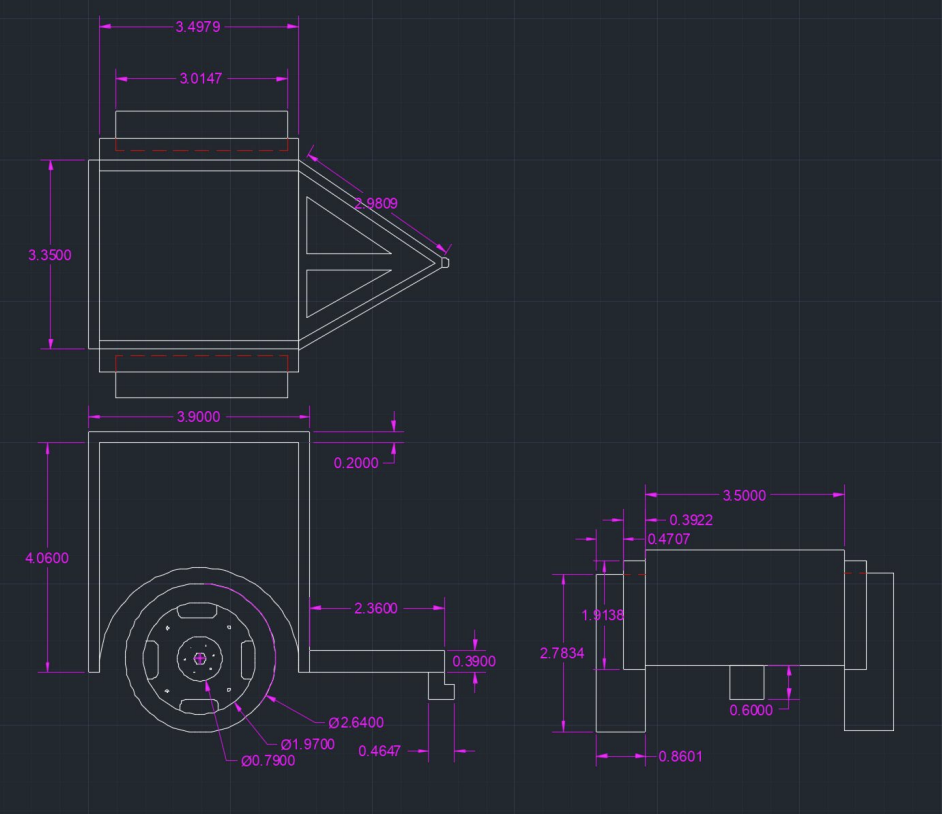

<h1>Entertainment Robot</h1>

<h2>Description</h2>
Given the rise of COVID-19 cases, it’s essential that both kids and parents stay in quarantine to prevent the spread of the virus. In order to keep them from visiting friends and not social distancing, parents need a way to entertain the kids, even as they work from home.
The objectives of our team to address this issue was to create a distraction for kids that is entertaining so parents don’t have to be with them at all times and can work from home. Additionally, our team also aimed to keep people inside and enforcing quarantine with limited interactions.
<br />

<h2>Robot Functions: </h2>
● A fun robot to entertain kids so they stay indoors. </br>
● Easy to play with at home. </br>
● Has a variety of components so kids aren’t bored easily. </br>
● Applies to kids at different ages. </br>
● Safe for children to play with. </br>

<h2>Robot Constraints: </h2>
● Difficult to entertain more than one kid, so, for a larger family, many robots may be needed. </br>
● The kids could get bored of the same repetitive games. </br>
● Difficult to design something for toddlers due to small pieces, as well as kids older than 10. </br>

<h2>CAD Design</h2>

<p align="center">
Launch the utility: <br/>

<br />

<h2>Environments Used </h2>

- <b>Windows 10</b> (21H2)

<h2>Program walk-through:</h2>

<p align="center">
Launch the utility: <br/>

<br />
<br />
Select the disk:  <br/>

<br />
<br />
Enter the number of passes: <br/>

<br />
<br />
Confirm your selection:  <br/>

<br />
<br />
Wait for process to complete (may take some time):  <br/>

<br />
<br />
Sanitization complete:  <br/>

<br />
<br />
Observe the wiped disk:  <br/>

</p>

<!--
 ```diff
- text in red
+ text in green
! text in orange
# text in gray
@@ text in purple (and bold)@@
```
--!>
